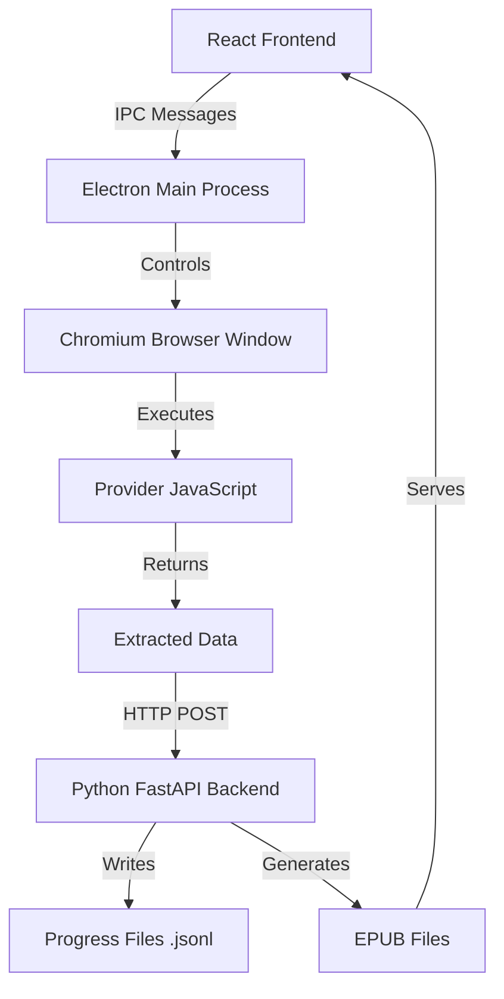
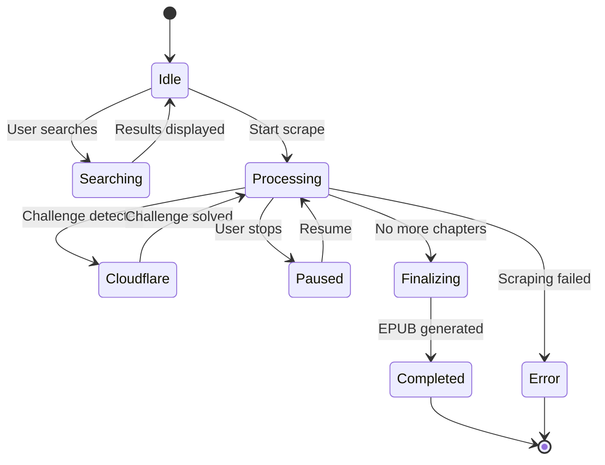
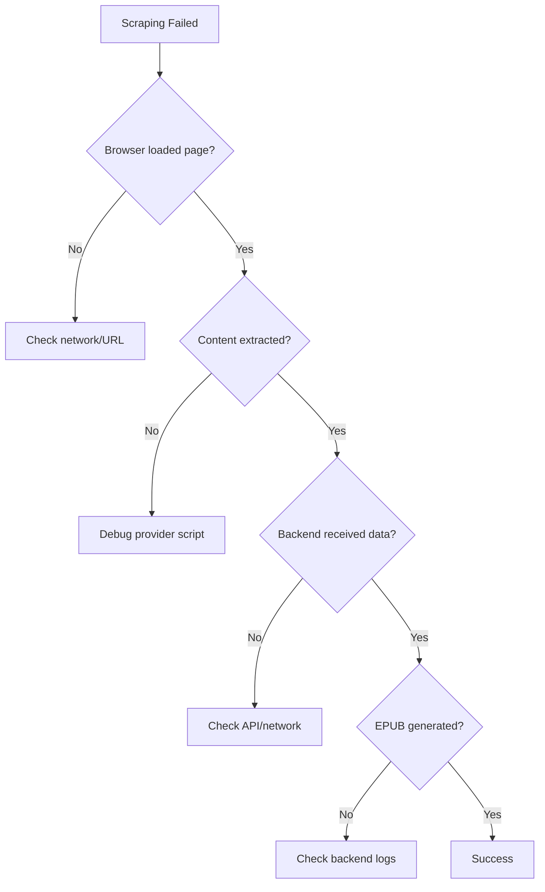

## Overview

Universal Novel Scraper uses a sophisticated multi-process architecture where Electron controls a Chromium browser to scrape content like a real user, then sends that data to a Python FastAPI backend for processing and EPUB generation.

This page documents the complete scraping workflow from start to finish.

## Architecture Diagram



## Component Responsibilities

<CardGroup cols={3}>
  <Card title="React Frontend" icon="browser">
    - User interface
    - Download manager UI
    - Library browser
    - Settings & controls
  </Card>
  
  <Card title="Electron Main" icon="gears">
    - Browser window management
    - IPC message routing
    - Provider loading
    - Scraping orchestration
  </Card>
  
  <Card title="Chromium Browser" icon="window-maximize">
    - Page loading
    - JavaScript execution
    - DOM manipulation
    - Cloudflare bypass
  </Card>
  
  <Card title="Provider Scripts" icon="plug">
    - Site-specific selectors
    - Content extraction
    - Navigation logic
  </Card>
  
  <Card title="Python Backend" icon="python">
    - Chapter storage
    - Progress tracking
    - EPUB compilation
    - File management
  </Card>
  
  <Card title="File System" icon="folder">
    - EPUB storage
    - Job history
    - Progress logs
  </Card>
</CardGroup>

## Complete Scraping Flow

### Phase 1: Novel Discovery

<Steps>
  <Step title="User Searches for Novel">
    User enters a search query in the Search page and selects a provider.
    
    ```javascript
    // Frontend sends IPC message
    const results = await window.electronAPI.searchNovel({
        sourceId: 'example-site',
        query: 'cultivation novel',
        page: 1
    });
    ```
  </Step>

  <Step title="Provider URL Generation">
    Electron retrieves the provider and generates search URL:
    
    ```javascript
    // From main.js:356-369
    ipcMain.handle('search-novel', async (event, { sourceId, query, page = 1 }) => {
        const provider = providers[sourceId];
        if (!provider) return [];
        
        const searchUrl = provider.getSearchUrl(query, page);
        // Example: "https://example.com/search?q=cultivation+novel&page=1"
    });
    ```
  </Step>

  <Step title="Browser Loads Search Page">
    Electron opens a hidden browser window and loads the URL:
    
    ```javascript
    if (!scraperWindow || scraperWindow.isDestroyed()) createScraperWindow();
    await scraperWindow.loadURL(searchUrl);
    await scraperWindow.webContents.executeJavaScript(
        `new Promise(resolve => {
            if (document.readyState === 'complete') resolve();
            else window.addEventListener('load', resolve);
        })`
    );
    ```
  </Step>

  <Step title="DOM Extraction">
    Provider's `getListScript()` runs in the page context:
    
    ```javascript
    const results = await scraperWindow.webContents.executeJavaScript(
        provider.getListScript()
    );
    
    // Returns array like:
    // [
    //   { title: "Novel 1", url: "https://...", cover: "https://..." },
    //   { title: "Novel 2", url: "https://...", cover: "https://..." }
    // ]
    ```
  </Step>

  <Step title="Results Displayed">
    Results are sent back to React frontend and displayed as cards.
  </Step>
</Steps>

### Phase 2: Novel Metadata Extraction

<Steps>
  <Step title="User Clicks Novel">
    User clicks on a search result to view details.
    
    ```javascript
    const details = await window.electronAPI.getNovelDetails({
        sourceId: 'example-site',
        novelUrl: 'https://example.com/novel/cultivation-story'
    });
    ```
  </Step>

  <Step title="Novel Page Loads">
    Electron loads the novel's main page with retry logic:
    
    ```javascript
    // From main.js:400-444
    ipcMain.handle('get-novel-details', async (event, args) => {
        const provider = providers[sourceId];
        
        // Use Google referrer to appear legitimate
        await scraperWindow.loadURL(novelUrl, { 
            httpReferrer: 'https://www.google.com/' 
        });
        
        // Retry up to 15 times (15 seconds) for slow-loading sites
        for (let attempts = 0; attempts < 15; attempts++) {
            await new Promise(r => setTimeout(r, 1000));
            
            if (scraperWindow.webContents.isLoading()) continue;
            
            try {
                details = await scraperWindow.webContents.executeJavaScript(
                    provider.getNovelDetailsScript()
                );
                
                if (details && (details.description || details.allChapters.length > 0)) {
                    return details;
                }
            } catch (jsErr) {
                console.log(`Retry ${attempts + 1}: ${jsErr.message}`);
            }
        }
    });
    ```
  </Step>

  <Step title="Extract Metadata">
    Provider script extracts:
    
    - Novel description/synopsis
    - Complete chapter list with titles and URLs
    - Author name (if available)
    - Cover image URL
    
    ```javascript
    // Example return value
    {
        description: "A young cultivator embarks on a journey...",
        allChapters: [
            { title: "Chapter 1: Beginning", url: "https://..." },
            { title: "Chapter 2: Awakening", url: "https://..." },
            // ... 500 more chapters
        ]
    }
    ```
  </Step>

  <Step title="Display Novel Page">
    Frontend shows:
    - Cover image
    - Description
    - Chapter count
    - "Start Scrape" button
    - Chapter range selector
  </Step>
</Steps>

### Phase 3: Scraping Initialization

<Steps>
  <Step title="User Configures Scrape">
    User sets scraping options:
    
    - Start chapter (default: 1)
    - End chapter (default: last)
    - Enable Cloudflare bypass checkbox
    - Show browser window toggle
  </Step>

  <Step title="Job Creation">
    Frontend sends job data via IPC:
    
    ```javascript
    const jobData = {
        job_id: generateUniqueId(), // UUID or timestamp
        novel_name: "Cultivation Story",
        author: "Unknown Author",
        sourceId: "example-site",
        start_url: "https://example.com/chapter/1",
        cover_data: "https://example.com/cover.jpg",
        enable_cloudflare_bypass: true
    };
    
    window.electronAPI.startScrape(jobData);
    ```
  </Step>

  <Step title="Electron State Setup">
    Main process initializes scraping state:
    
    ```javascript
    // From main.js:446-464
    ipcMain.on('start-browser-scrape', async (event, jobData) => {
        if (isScraping && currentJobId === jobData.job_id) return;
        
        // Reset state
        scrapeCancelled = false;
        isScraping = true;
        currentJobId = jobData.job_id;
        enableCloudflareBypass = jobData.enable_cloudflare_bypass || false;
        showBrowserWindow = false;
        
        // Check if resuming
        let startChapter = 1;
        let actualUrl = jobData.start_url;
        
        try {
            const statusRes = await axios.get(`http://127.0.0.1:8000/api/status/${jobData.job_id}`);
            if (statusRes.data.chapters_count > 0) {
                startChapter = statusRes.data.chapters_count + 1;
            }
        } catch (e) {}
        
        // Start scraping
        await scrapeChapter(event, jobData, actualUrl, startChapter);
    });
    ```
  </Step>
</Steps>

### Phase 4: Chapter Scraping Loop

This is the core of the scraping process:

<Steps>
  <Step title="Load Chapter Page">
    Browser navigates to chapter URL:
    
    ```javascript
    // From main.js:148-156
    async function scrapeChapter(event, jobData, url, chapterNum) {
        if (scrapeCancelled) { isScraping = false; return; }
        
        if (!scraperWindow || scraperWindow.isDestroyed()) createScraperWindow();
        
        event.sender.send('scrape-status', { 
            status: 'LOADING', 
            message: `Chapter ${chapterNum}: Fetching...` 
        });
        
        await scraperWindow.loadURL(url);
        
        // Random delay to appear human-like
        await new Promise(resolve => setTimeout(resolve, 
            enableCloudflareBypass ? getRandomTimeout(1500, 4000) : getRandomTimeout(100, 500)
        ));
    }
    ```
  </Step>

  <Step title="Cloudflare Detection">
    Check if Cloudflare challenge is present:
    
    ```javascript
    // From main.js:126-133
    const hasCloudflare = await detectCloudflare(scraperWindow);
    
    if (hasCloudflare && enableCloudflareBypass) {
        event.sender.send('scrape-status', { 
            status: 'CLOUDFLARE', 
            message: '🛡️ Manual solve required.' 
        });
        
        scraperWindow.show();
        scraperWindow.focus();
        waitingForHuman = true;
        
        const solved = await waitForCloudflareSolve(scraperWindow, jobData.job_id);
        waitingForHuman = false;
        
        if (!solved || scrapeCancelled) return;
        
        await new Promise(r => setTimeout(r, 2000));
        if (!showBrowserWindow) scraperWindow.hide();
    }
    ```
    
    See [Cloudflare Bypass](/advanced/cloudflare-bypass) for details.
  </Step>

  <Step title="Content Extraction">
    Execute provider's chapter script:
    
    ```javascript
    // From main.js:172-202
    const provider = providers[jobData.sourceId];
    let pageData;
    
    // Try provider-specific script first
    if (provider && typeof provider.getChapterScript === 'function') {
        pageData = await scraperWindow.webContents.executeJavaScript(
            provider.getChapterScript()
        );
    } else {
        // Fallback to generic selectors
        pageData = await scraperWindow.webContents.executeJavaScript(`
            (() => {
                const title = document.querySelector('.chr-title, .chapter-title, h1')?.innerText?.trim();
                
                const contentSelectors = [
                    '#chr-content p', 
                    '.chapter-content p', 
                    '.reading-content p'
                ];
                let paragraphs = [];
                for (let selector of contentSelectors) {
                    const found = Array.from(document.querySelectorAll(selector))
                        .map(p => p.innerText.trim())
                        .filter(p => p.length > 0);
                    if (found.length > 0) { 
                        paragraphs = found; 
                        break; 
                    }
                }
                
                const nextBtn = Array.from(document.querySelectorAll('a')).find(a => {
                    const text = (a.innerText || '').toLowerCase();
                    return text.includes('next') && 
                           !text.includes('previous') && 
                           a.href.startsWith('http');
                });
                
                return { 
                    title: title || 'Untitled Chapter', 
                    paragraphs, 
                    nextUrl: nextBtn?.href || null 
                };
            })()
        `);
    }
    
    // Validation
    if (!pageData.paragraphs || pageData.paragraphs.length === 0) {
        throw new Error('No content found.');
    }
    ```
  </Step>

  <Step title="Send to Backend">
    POST chapter data to Python API:
    
    ```javascript
    // From main.js:207-217
    await axios.post('http://127.0.0.1:8000/api/save-chapter', {
        job_id: jobData.job_id,
        novel_name: jobData.novel_name,
        chapter_title: pageData.title,
        author: jobData.author,
        cover_data: jobData.cover_data,
        content: pageData.paragraphs,
        start_url: url,
        next_url: pageData.nextUrl,
        sourceId: jobData.sourceId
    });
    
    event.sender.send('scrape-status', { 
        status: 'SAVED', 
        message: `✓ Saved Chapter ${chapterNum}` 
    });
    ```
  </Step>

  <Step title="Backend Saves Chapter">
    Python backend processes the chapter:
    
    ```python
    # From api.py:136-186
    @app.post("/api/save-chapter")
    def save_chapter(data: dict):
        job_id = data.get("job_id")
        progress_file = get_progress_file(job_id)  # jobs/<job_id>_progress.jsonl
        
        # 1. Prepare chapter data
        chapter_title = data.get("chapter_title", "Untitled")
        content = data.get("content", [])
        chapter_info = [chapter_title, content]
        
        # 2. Append to progress file (.jsonl = JSON Lines format)
        with open(progress_file, "a", encoding="utf-8") as f:
            f.write(json.dumps(chapter_info, ensure_ascii=False) + "\n")
        
        # 3. Count total chapters
        with open(progress_file, "r", encoding="utf-8") as f:
            current_count = sum(1 for _ in f)
        
        # 4. Update job metadata
        next_chapter_url = data.get("next_url") or data.get("start_url")
        
        if job_id not in jobs:
            jobs[job_id] = {
                "novel_name": data.get("novel_name", "Unknown Novel"),
                "status": "processing",
                "author": data.get("author", "Unknown"),
                "cover_data": data.get("cover_data", ""),
                "start_url": next_chapter_url,
                "sourceId": data.get("sourceId", "generic"),
                "chapters_count": current_count
            }
        else:
            jobs[job_id]["status"] = "processing"
            jobs[job_id]["chapters_count"] = current_count
            if next_chapter_url:
                jobs[job_id]["start_url"] = next_chapter_url
        
        # 5. Persist to disk
        save_history(jobs)  # Updates history/jobs_history.json
        return {"status": "ok", "job_id": job_id}
    ```
    
    Each chapter is appended as a JSON line:
    ```json
    ["Chapter 1: Beginning", ["Paragraph 1", "Paragraph 2", ...]]
    ["Chapter 2: Awakening", ["Paragraph 1", "Paragraph 2", ...]]
    ```
  </Step>

  <Step title="Navigate to Next Chapter">
    If there's a next chapter URL, continue the loop:
    
    ```javascript
    // From main.js:221-228
    if (pageData.nextUrl && pageData.nextUrl !== url) {
        // Random delay between chapters
        const delay = enableCloudflareBypass 
            ? getRandomTimeout(1500, 4000) 
            : getRandomTimeout(100, 500);
        
        // Cancellation check during delay
        for (let i = 0; i < delay; i += 100) {
            if (scrapeCancelled) { 
                isScraping = false; 
                return; 
            }
            await new Promise(r => setTimeout(r, 100));
        }
        
        // Recursive call for next chapter
        await scrapeChapter(event, jobData, pageData.nextUrl, chapterNum + 1);
    }
    ```
  </Step>

  <Step title="Finalization Trigger">
    When no next chapter URL is found, finalize:
    
    ```javascript
    // From main.js:229-237
    else {
        event.sender.send('scrape-status', { 
            status: 'FINALIZING', 
            message: '📦 Generating EPUB...' 
        });
        
        await axios.post('http://127.0.0.1:8000/api/finalize-epub', {
            job_id: jobData.job_id,
            novel_name: jobData.novel_name,
            author: jobData.author,
            cover_data: jobData.cover_data
        });
        
        event.sender.send('scrape-status', { 
            status: 'COMPLETED', 
            message: '✅ Success!' 
        });
        
        isScraping = false;
        if (!showBrowserWindow) scraperWindow?.hide();
    }
    ```
  </Step>
</Steps>

### Phase 5: EPUB Generation

<Steps>
  <Step title="Backend Receives Finalization Request">
    Python API endpoint is called:
    
    ```python
    # From api.py:188-220
    @app.post("/api/finalize-epub")
    def finalize_epub(data: FinalizeData):
        job_id = data.job_id
        progress_file = get_progress_file(job_id)  # jobs/<job_id>_progress.jsonl
        epub_file = get_epub_file(job_id)  # epubs/<job_id>.epub
        
        if not os.path.exists(progress_file):
            raise HTTPException(status_code=404, detail="No chapters found")
    ```
  </Step>

  <Step title="Load All Chapters">
    Read the entire progress file:
    
    ```python
    chapters = []
    with open(progress_file, "r", encoding="utf-8") as f:
        for line in f:
            chapters.append(json.loads(line))
    
    # chapters is now:
    # [
    #   ["Chapter 1: Beginning", ["Para 1", "Para 2", ...]],
    #   ["Chapter 2: Awakening", ["Para 1", "Para 2", ...]],
    #   ...
    # ]
    ```
  </Step>

  <Step title="Create EPUB Structure">
    Build EPUB using ebooklib:
    
    ```python
    # From api.py:360-400
    def create_epub(novel_title, author, chapters, output_filename, cover_data=""):
        book = epub.EpubBook()
        book.set_title(novel_title)
        if author: 
            book.add_author(author)
        
        # Add cover image
        if cover_data:
            try:
                if cover_data.startswith("http"):
                    # Download from URL
                    response = requests.get(cover_data, timeout=10)
                    if response.status_code == 200:
                        ext = "jpg"
                        if ".png" in cover_data.lower(): ext = "png"
                        book.set_cover(f"cover.{ext}", response.content)
                else:
                    # Decode base64
                    header, encoded = cover_data.split(",", 1)
                    ext = header.split(";")[0].split("/")[1]
                    book.set_cover(f"cover.{ext}", base64.b64decode(encoded))
            except Exception as e:
                print(f"⚠️ Failed to add cover: {e}")
        
        # Create chapter items
        spine = ['nav']
        toc = []
        
        for i, (title, content) in enumerate(chapters):
            chapter = epub.EpubHtml(
                title=title, 
                file_name=f'chap_{i+1}.xhtml'
            )
            
            # Build HTML content
            chapter.content = f'<h1>{title}</h1>' + "".join([
                f'<p>{p}</p>' for p in content if p.strip()
            ])
            
            book.add_item(chapter)
            spine.append(chapter)
            toc.append(chapter)
        
        # Finalize structure
        book.toc = tuple(toc)
        book.add_item(epub.EpubNav())
        book.spine = spine
        
        # Write to disk
        epub.write_epub(output_filename, book)
    ```
  </Step>

  <Step title="Update Job Status">
    Mark job as completed:
    
    ```python
    jobs[job_id]["status"] = "completed"
    jobs[job_id]["chapters_count"] = len(chapters)
    
    # Remove from active scrapes
    if job_id in active_scrapes:
        del active_scrapes[job_id]
        save_active_scrapes(active_scrapes)
    
    save_history(jobs)
    
    # Clean up progress file
    if os.path.exists(progress_file):
        os.remove(progress_file)
    
    return {"status": "completed", "epub_path": epub_file}
    ```
  </Step>

  <Step title="EPUB Available">
    The EPUB is now stored in:
    
    ```
    <userData>/output/epubs/<job_id>.epub
    ```
    
    And appears in:
    - Library page (with extracted cover)
    - History page (with download link)
  </Step>
</Steps>

## Data Flow Summary

### Request Flow

```
┌─────────────┐
│   React UI  │
└──────┬──────┘
       │ IPC: start-browser-scrape
       ▼
┌─────────────┐
│  Electron   │
│ Main Process│
└──────┬──────┘
       │ Controls
       ▼
┌─────────────┐
│  Chromium   │
│   Browser   │
└──────┬──────┘
       │ executeJavaScript(provider.getChapterScript())
       ▼
┌─────────────┐
│   Provider  │
│   Script    │
└──────┬──────┘
       │ Returns { title, paragraphs, nextUrl }
       ▼
┌─────────────┐
│  Electron   │
└──────┬──────┘
       │ HTTP POST /api/save-chapter
       ▼
┌─────────────┐
│   Python    │
│  FastAPI    │
└──────┬──────┘
       │ Writes to
       ▼
┌─────────────┐
│ Progress    │
│ File .jsonl │
└─────────────┘
```

### File Storage Structure

```
<userData>/output/
├── history/
│   ├── jobs_history.json          # All job metadata
│   └── active_scrapes.json        # Paused/in-progress jobs
├── jobs/
│   ├── abc123_progress.jsonl      # Chapter data for job abc123
│   └── def456_progress.jsonl      # Chapter data for job def456
└── epubs/
    ├── abc123.epub                 # Completed EPUB
    └── def456.epub                 # Completed EPUB
```

### jobs_history.json Format

```json
{
  "abc123": {
    "novel_name": "Cultivation Story",
    "status": "completed",
    "author": "Unknown Author",
    "cover_data": "https://example.com/cover.jpg",
    "start_url": "https://example.com/chapter/150",
    "sourceId": "example-site",
    "chapters_count": 150,
    "last_updated": "1735689123.456"
  },
  "def456": {
    "novel_name": "Another Novel",
    "status": "processing",
    "author": "Some Author",
    "sourceId": "another-site",
    "chapters_count": 45,
    "start_url": "https://another-site.com/chapter/46"
  }
}
```

### Progress File (.jsonl) Format

```json
["Chapter 1: The Beginning", ["First paragraph.", "Second paragraph.", "Third paragraph."]]
["Chapter 2: Awakening", ["More content here.", "And more."]]
["Chapter 3: Journey Starts", ["Paragraph 1", "Paragraph 2"]]
```

Each line is a complete JSON array with:
1. Chapter title (string)
2. Array of paragraphs (array of strings)

## State Management

### Global State Variables

```javascript
// From main.js:7-18
let mainWindow = null;              // React UI window
let scraperWindow = null;           // Hidden browser for scraping
let pythonProcess = null;           // Backend subprocess
let isScraping = false;             // Scraping in progress
let scrapeCancelled = false;        // User cancelled
let providers = {};                 // Loaded provider plugins
let enableCloudflareBypass = false; // Current job setting
let currentJobId = null;            // Current job identifier
let waitingForHuman = false;        // Cloudflare challenge active
let showBrowserWindow = false;      // Debug mode
```

### State Transitions



## Error Handling

### Chapter Scraping Errors

```javascript
// From main.js:238-242
catch (err) {
    event.sender.send('scrape-status', { 
        status: 'ERROR', 
        message: `Error: ${err.message}` 
    });
    isScraping = false;
}
```

Common errors:
- **No content found:** Provider selectors don't match page structure
- **Timeout:** Page takes too long to load
- **Network error:** Connection issues
- **Cloudflare timeout:** Challenge not solved within 60 seconds

### Backend Errors

```python
# From api.py:194-195
if not os.path.exists(progress_file):
    raise HTTPException(status_code=404, detail="No chapters found")
```

The backend returns HTTP error codes:
- **400:** Missing required fields
- **404:** File/job not found
- **500:** Internal server error

## Performance Characteristics

### Scraping Speed

| Configuration | Chapters/Minute | Notes |
|---------------|-----------------|-------|
| **Normal mode** | 60-120 | 100-500ms delay between chapters |
| **Cloudflare bypass** | 15-40 | 1500-4000ms delay between chapters |
| **Show browser** | 50-100 | Similar to normal, slight overhead |

### Resource Usage

- **Memory:** ~200-400 MB (Electron + Chromium + Python)
- **CPU:** Low (mostly waiting for network)
- **Disk I/O:** Minimal (small JSON writes, final EPUB write)
- **Network:** Depends on chapter size, typically 50-200 KB per chapter

## Pause and Resume

UNS supports pausing and resuming scrapes:

<Steps>
  <Step title="User Clicks Stop">
    Frontend sends stop command:
    
    ```javascript
    window.electronAPI.stopScrape(jobData);
    ```
  </Step>

  <Step title="Set Cancellation Flag">
    Electron sets global flag:
    
    ```javascript
    // From main.js:466-474
    ipcMain.on('stop-scrape', async (event, jobData) => {
        scrapeCancelled = true;
        isScraping = false;
        
        event.sender.send('scrape-status', { 
            status: 'STOPPING', 
            message: '⏹️ Stopping...' 
        });
    ```
    
    The scraping loop checks this flag:
    ```javascript
    if (scrapeCancelled) { isScraping = false; return; }
    ```
  </Step>

  <Step title="Backend Updates Status">
    Python marks job as paused:
    
    ```python
    # From api.py:322-346
    @app.post("/api/stop-scrape")
    def stop_scrape(data: StopScrapeData):
        job_id = data.job_id
        
        jobs[job_id]["status"] = "paused"
        save_history(jobs)
        
        # Track pause point
        active_scrapes[job_id] = {
            "paused_at": chapter_count,
            "last_chapter": last_chapter_title
        }
        save_active_scrapes(active_scrapes)
    ```
  </Step>

  <Step title="Resume from Last Chapter">
    When resuming:
    
    ```javascript
    // From main.js:244-267
    ipcMain.on('resume-scrape', async (event, jobData) => {
        const response = await axios.get(`http://127.0.0.1:8000/api/status/${jobData.job_id}`);
        const statusData = response.data;
        
        // Start from next chapter
        const startChapter = statusData.chapters_count + 1;
        
        scrapeCancelled = false;
        isScraping = true;
        
        await scrapeChapter(event, jobData, jobData.start_url, startChapter);
    });
    ```
    
    The `start_url` in job history is updated after each chapter, so resume continues from the correct URL.
  </Step>
</Steps>

## Best Practices

<CardGroup cols={2}>
  <Card title="Check Progress Files" icon="file-lines">
    During development, inspect `.jsonl` files to debug extraction issues:
    
    ```bash
    cat <userData>/output/jobs/abc123_progress.jsonl | jq
    ```
  </Card>
  
  <Card title="Monitor Backend Logs" icon="terminal">
    Run backend manually to see detailed logs:
    
    ```bash
    python backend/api.py
    ```
  </Card>
  
  <Card title="Test with Small Ranges" icon="flask">
    When testing providers, scrape only 2-3 chapters first.
  </Card>
  
  <Card title="Use Show Browser" icon="window-maximize">
    Enable "Show Browser" to watch real-time scraping and debug issues.
  </Card>
</CardGroup>

## Troubleshooting Flow

When scraping fails, trace through the pipeline:



<AccordionGroup>
  <Accordion title="Page won't load">
    - Check if URL is valid
    - Test URL in regular browser
    - Check for Cloudflare (enable bypass)
    - Check internet connection
  </Accordion>

  <Accordion title="No content extracted">
    - Enable "Show Browser" to see actual page
    - Open DevTools on scraper window
    - Test provider script in console
    - Check if selectors match page HTML
    - Verify page isn't login-protected
  </Accordion>

  <Accordion title="Backend errors">
    - Check Python backend is running (port 8000)
    - Review backend console logs
    - Check file permissions on output directory
    - Verify disk space available
  </Accordion>

  <Accordion title="EPUB generation fails">
    - Check progress file exists and has content
    - Verify ebooklib is installed
    - Check for invalid characters in novel/chapter titles
    - Review backend logs for stack trace
  </Accordion>
</AccordionGroup>

## Next Steps

<CardGroup cols={2}>
  <Card title="Cloudflare Bypass" icon="shield-check" href="/advanced/cloudflare-bypass">
    Learn how to handle Cloudflare challenges
  </Card>
  
  <Card title="Provider System" icon="plug" href="/advanced/providers">
    Create custom providers for new websites
  </Card>
  
  <Card title="Quick Start" icon="rocket" href="/quickstart">
    Back to basics: Using UNS as a user
  </Card>
  
  <Card title="Troubleshooting" icon="wrench" href="/troubleshooting">
    Common issues and solutions
  </Card>
</CardGroup>