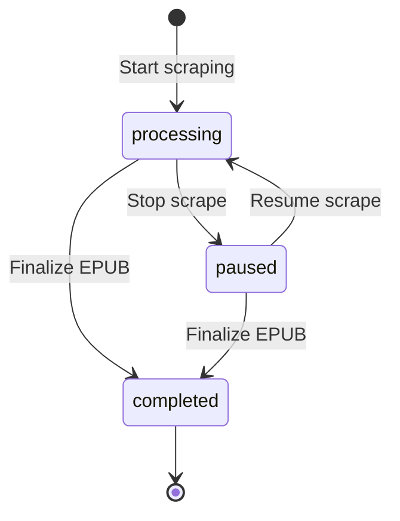

## Get History

<api method="GET" endpoint="/api/history" />

Retrieves the complete history of all scraping jobs, including active, paused, and completed ones.

### Response

Returns an object where keys are job IDs and values are job metadata:

<ResponseField name="job_id" type="object">
  Job metadata object (see structure below)
</ResponseField>

### Job Metadata Structure

<ResponseField name="novel_name" type="string">
  The title of the novel
</ResponseField>

<ResponseField name="status" type="string">
  Current status: `"processing"`, `"paused"`, or `"completed"`
</ResponseField>

<ResponseField name="author" type="string">
  Author name (defaults to "Unknown" if not provided)
</ResponseField>

<ResponseField name="cover_data" type="string">
  Cover image as base64 data URI or URL
</ResponseField>

<ResponseField name="start_url" type="string">
  URL of the next chapter to scrape (bookmark)
</ResponseField>

<ResponseField name="sourceId" type="string">
  Provider identifier (e.g., "allnovel", "lightnovelworld")
</ResponseField>

<ResponseField name="chapters_count" type="number">
  Total number of chapters scraped
</ResponseField>

<ResponseField name="last_updated" type="string">
  Unix timestamp of last progress file modification
</ResponseField>

### Example Request

```bash
curl http://127.0.0.1:8000/api/history
```

### Example Response

```json
{
  "a1b2c3d4-e5f6-7890-abcd-ef1234567890": {
    "novel_name": "Epic Fantasy Novel",
    "status": "processing",
    "author": "Jane Doe",
    "cover_data": "https://example.com/cover.jpg",
    "start_url": "https://example.com/novel/chapter-43",
    "sourceId": "allnovel",
    "chapters_count": 42,
    "last_updated": "1709856000.123"
  },
  "b2c3d4e5-f6a7-8901-bcde-f12345678901": {
    "novel_name": "Mystery Thriller",
    "status": "completed",
    "author": "John Smith",
    "cover_data": "",
    "start_url": "https://example.com/mystery/chapter-1",
    "sourceId": "lightnovelworld",
    "chapters_count": 156,
    "last_updated": "1709842400.456"
  },
  "c3d4e5f6-a7b8-9012-cdef-123456789012": {
    "novel_name": "Romance Novel",
    "status": "paused",
    "author": "Unknown",
    "cover_data": "data:image/jpeg;base64,/9j/4AAQ...",
    "start_url": "https://example.com/romance/chapter-25",
    "sourceId": "generic",
    "chapters_count": 24,
    "last_updated": "1709829000.789"
  }
}
```

### Empty History

If no jobs exist:

```json
{}
```

### JavaScript Example

```javascript
const getHistory = async () => {
  const response = await fetch('http://127.0.0.1:8000/api/history');
  const history = await response.json();
  
  // Convert to array for easier manipulation
  const jobs = Object.entries(history).map(([jobId, data]) => ({
    jobId,
    ...data
  }));
  
  // Filter by status
  const processing = jobs.filter(j => j.status === 'processing');
  const paused = jobs.filter(j => j.status === 'paused');
  const completed = jobs.filter(j => j.status === 'completed');
  
  console.log(`Processing: ${processing.length}`);
  console.log(`Paused: ${paused.length}`);
  console.log(`Completed: ${completed.length}`);
  
  return jobs;
};
```

### Python Example

```python
import requests
from collections import defaultdict

def get_history():
    response = requests.get('http://127.0.0.1:8000/api/history')
    history = response.json()
    
    # Group by status
    by_status = defaultdict(list)
    for job_id, data in history.items():
        by_status[data['status']].append({
            'job_id': job_id,
            **data
        })
    
    print(f"Processing: {len(by_status['processing'])}")
    print(f"Paused: {len(by_status['paused'])}")
    print(f"Completed: {len(by_status['completed'])}")
    
    return history
```

## Check Status

<api method="GET" endpoint="/api/status/{job_id}" />

Retrieves detailed status information for a specific scraping job.

### Path Parameters

<ParamField path="job_id" type="string" required>
  The job identifier
</ParamField>

### Response

<ResponseField name="job_id" type="string">
  The job identifier
</ResponseField>

<ResponseField name="status" type="string">
  Current status: `"processing"`, `"paused"`, `"completed"`, or `"not found"`
</ResponseField>

<ResponseField name="progress" type="string">
  Human-readable progress text (e.g., "42 chapters scraped")
</ResponseField>

<ResponseField name="chapters_count" type="number">
  Exact number of chapters scraped
</ResponseField>

<ResponseField name="novel_name" type="string">
  The novel's title
</ResponseField>

### Status Types

#### Processing

```json
{
  "job_id": "a1b2c3d4-e5f6-7890-abcd-ef1234567890",
  "status": "processing",
  "progress": "42 chapters scraped",
  "chapters_count": 42,
  "novel_name": "Epic Fantasy Novel"
}
```

#### Paused

Includes last chapter title:

```json
{
  "job_id": "a1b2c3d4-e5f6-7890-abcd-ef1234567890",
  "status": "paused",
  "progress": "42 chapters scraped (Last: Chapter 42: The Cliffhanger)",
  "chapters_count": 42,
  "novel_name": "Epic Fantasy Novel"
}
```

#### Completed

```json
{
  "job_id": "a1b2c3d4-e5f6-7890-abcd-ef1234567890",
  "status": "completed",
  "progress": "156 chapters scraped",
  "chapters_count": 156,
  "novel_name": "Epic Fantasy Novel"
}
```

#### Not Found

```json
{
  "job_id": "unknown-id",
  "status": "not found",
  "progress": "0 chapters scraped",
  "chapters_count": 0,
  "novel_name": "Unknown"
}
```

### Example Request

```bash
curl http://127.0.0.1:8000/api/status/a1b2c3d4-e5f6-7890-abcd-ef1234567890
```

### JavaScript Example

```javascript
const checkStatus = async (jobId) => {
  const response = await fetch(`http://127.0.0.1:8000/api/status/${jobId}`);
  const status = await response.json();
  
  console.log(`${status.novel_name}: ${status.status}`);
  console.log(status.progress);
  
  return status;
};

// Poll for updates
const pollStatus = async (jobId, interval = 2000) => {
  const poll = async () => {
    const status = await checkStatus(jobId);
    
    if (status.status === 'completed') {
      console.log('Scraping finished!');
      return status;
    }
    
    if (status.status === 'paused') {
      console.log('Scraping paused');
      return status;
    }
    
    // Continue polling
    setTimeout(poll, interval);
  };
  
  await poll();
};
```

### Python Example

```python
import requests
import time

def check_status(job_id):
    response = requests.get(f'http://127.0.0.1:8000/api/status/{job_id}')
    status = response.json()
    
    print(f"{status['novel_name']}: {status['status']}")
    print(status['progress'])
    
    return status

def poll_until_complete(job_id, interval=2):
    """Poll status until job completes or pauses"""
    while True:
        status = check_status(job_id)
        
        if status['status'] in ['completed', 'paused']:
            print(f"Job {status['status']}")
            return status
        
        time.sleep(interval)
```

## History Persistence

History data is stored in JSON files:

### jobs_history.json

Location: `userData/output/history/jobs_history.json`

Contains all job metadata. Updated whenever:
- A chapter is saved
- A job is paused
- A job is completed
- A job is deleted

### active_scrapes.json

Location: `userData/output/history/active_scrapes.json`

Tracks paused jobs for resumption:

```json
{
  "a1b2c3d4-e5f6-7890-abcd-ef1234567890": {
    "paused_at": 42,
    "last_chapter": "Chapter 42: The Cliffhanger"
  }
}
```

This file is used by `/api/status/{job_id}` to determine if a job is paused.

## Status Flow Diagram



## History Management Best Practices

### 1. Periodic Cleanup

Remove old completed jobs:

```javascript
const cleanupCompleted = async (olderThanDays = 30) => {
  const history = await fetch('http://127.0.0.1:8000/api/history');
  const jobs = await history.json();
  
  const now = Date.now() / 1000;
  const cutoff = now - (olderThanDays * 24 * 60 * 60);
  
  for (const [jobId, data] of Object.entries(jobs)) {
    if (data.status === 'completed' && parseFloat(data.last_updated) < cutoff) {
      await fetch(`http://127.0.0.1:8000/api/novel/${jobId}`, {
        method: 'DELETE'
      });
      console.log(`Cleaned up: ${data.novel_name}`);
    }
  }
};
```

### 2. Resume Detection

Check if a job can be resumed:

```javascript
const canResume = async (jobId) => {
  const status = await fetch(`http://127.0.0.1:8000/api/status/${jobId}`);
  const data = await status.json();
  
  return data.status === 'paused' && data.chapters_count > 0;
};
```

### 3. Progress Monitoring

Display progress in UI:

```javascript
const ProgressMonitor = ({ jobId }) => {
  const [status, setStatus] = useState(null);
  
  useEffect(() => {
    const interval = setInterval(async () => {
      const response = await fetch(`http://127.0.0.1:8000/api/status/${jobId}`);
      const data = await response.json();
      setStatus(data);
    }, 2000);
    
    return () => clearInterval(interval);
  }, [jobId]);
  
  if (!status) return <div>Loading...</div>;
  
  return (
    <div>
      <h3>{status.novel_name}</h3>
      <p>Status: {status.status}</p>
      <p>{status.progress}</p>
      <progress value={status.chapters_count} max={status.expected_total || 100} />
    </div>
  );
};
```

## Troubleshooting

### History out of sync

If history shows incorrect chapter counts:

```bash
# Manually verify progress file
wc -l ~/Library/Application\ Support/universal-novel-scraper/output/jobs/[job_id]_progress.jsonl
```

Each line = one chapter. If counts mismatch, delete and restart the job.

### Paused jobs not resuming

Check `active_scrapes.json` exists and contains the job ID. If missing:

```javascript
// Manually mark as paused
await fetch('http://127.0.0.1:8000/api/stop-scrape', {
  method: 'POST',
  headers: { 'Content-Type': 'application/json' },
  body: JSON.stringify({ job_id: 'your-job-id' })
});
```

### Completed jobs still showing

Completed jobs remain in history until manually deleted:

```bash
curl -X DELETE http://127.0.0.1:8000/api/novel/[job_id]
```

This is intentional - allows users to view completion history.
