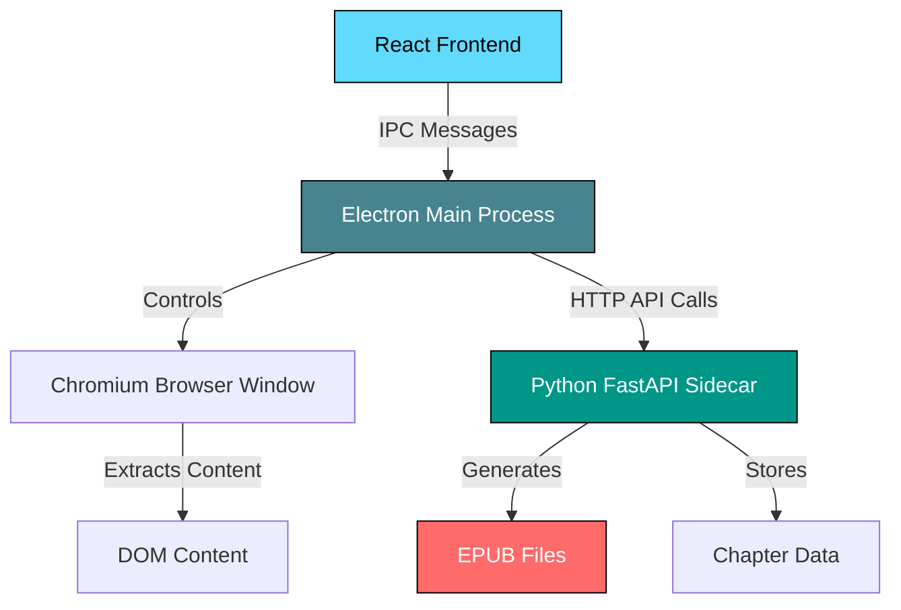

## Introduction

Universal Novel Scraper uses a **sidecar architecture pattern** where multiple specialized processes work together to deliver a seamless desktop application experience. This design enables the app to combine the power of Electron's Chromium browser with Python's EPUB generation capabilities.

## Architecture Diagram



## Why Sidecar Architecture?

The sidecar pattern was chosen for several critical reasons:

<CardGroup cols={2}>
  <Card title="Language Specialization" icon="code">
    JavaScript/Electron excels at browser automation, while Python is superior for document generation and file processing.
  </Card>
  
  <Card title="Bot Detection Bypass" icon="shield">
    Using Electron's built-in Chromium provides a real browser environment that bypasses most anti-bot protections including Cloudflare.
  </Card>
  
  <Card title="Process Isolation" icon="layer-group">
    The Python backend can crash and restart without affecting the UI. Each component can be developed and tested independently.
  </Card>
  
  <Card title="Resource Efficiency" icon="gauge-high">
    The Python engine runs only when needed and can be compiled into a single binary for production deployments.
  </Card>
</CardGroup>

## Component Communication

### IPC (Inter-Process Communication)

The React frontend communicates with Electron's main process through a secure IPC bridge:

```javascript main.js:1-3
const { app, BrowserWindow, ipcMain, shell, dialog } = require('electron');
const path = require('path');
const { execFile } = require('child_process');
```

The `preload.js` script exposes a secure API to the renderer process:

```javascript preload.js:3-11
contextBridge.exposeInMainWorld('electronAPI', {
    // Scraper control
    startScrape: (jobData) => ipcRenderer.send('start-browser-scrape', jobData),
    stopScrape: (jobData) => ipcRenderer.send('stop-scrape', jobData),
    resumeScrape: (jobData) => ipcRenderer.send('resume-scrape', jobData),
    toggleScraper: (show) => ipcRenderer.send('toggle-scraper-view', show),
    onEngineReady: (callback) => ipcRenderer.on('engine-ready', callback),
    addEpubToLibrary: () => ipcRenderer.invoke('add-epub-to-library'),
    openEpub: (filename) => ipcRenderer.send('open-epub', filename),
```

### HTTP API

The Electron main process communicates with the Python backend through HTTP REST API calls:

```javascript main.js:207-217
await axios.post('http://127.0.0.1:8000/api/save-chapter', {
    job_id: jobData.job_id,
    novel_name: jobData.novel_name,
    chapter_title: pageData.title,
    author: jobData.author,
    cover_data: jobData.cover_data,
    content: pageData.paragraphs,
    start_url: url,
    next_url: pageData.nextUrl,
    sourceId: jobData.sourceId
});
```

## Component Responsibilities

<AccordionGroup>
  <Accordion title="React Frontend - User Interface Layer">
    **Purpose**: Provides the visual interface and user interactions
    
    **Key Responsibilities**:
    - Render UI components and pages
    - Handle user input and form validation
    - Display scraping progress and logs
    - Manage library views and search results
    - Communicate with Electron via IPC
    
    **Technology Stack**:
    - React 18 with Hooks
    - React Router for navigation
    - Tailwind CSS for styling
    - Lucide React for icons
    
    [Learn more →](/architecture/react-frontend)
  </Accordion>
  
  <Accordion title="Electron Main Process - Orchestration Layer">
    **Purpose**: Manages the desktop application lifecycle and browser automation
    
    **Key Responsibilities**:
    - Create and manage browser windows
    - Control the scraper browser window
    - Execute JavaScript in web pages for content extraction
    - Start and monitor the Python backend process
    - Handle IPC messages from renderer
    - Manage provider plugins dynamically
    
    **Key Features**:
    - Cloudflare detection and bypass
    - Chapter-by-chapter recursive scraping
    - Session management and state tracking
    
    [Learn more →](/architecture/electron-main)
  </Accordion>
  
  <Accordion title="Python FastAPI Backend - Processing Engine">
    **Purpose**: Handles data persistence and EPUB generation
    
    **Key Responsibilities**:
    - Receive and store scraped chapters
    - Track job progress and status
    - Generate EPUB files from chapter data
    - Serve library and history data
    - Extract cover images from EPUBs
    
    **Technology Stack**:
    - FastAPI web framework
    - ebooklib for EPUB generation
    - Pydantic for data validation
    - File-based storage (JSONL)
    
    [Learn more →](/architecture/python-backend)
  </Accordion>
  
  <Accordion title="Chromium Browser - Scraping Engine">
    **Purpose**: Provides a real browser environment for web scraping
    
    **Key Advantages**:
    - Appears as a legitimate browser to websites
    - Handles JavaScript-heavy sites
    - Bypasses basic bot detection
    - Supports manual Cloudflare solving
    - Maintains cookies and sessions
    
    **How it works**: Electron creates an invisible `BrowserWindow` that loads target URLs and executes extraction scripts in the DOM context.
  </Accordion>
</AccordionGroup>

## Data Flow Example: Scraping a Chapter

Here's how the components work together when scraping a single chapter:

1. **User Action** (React Frontend)
   - User clicks "Start Scraping" button
   - Frontend calls `window.electronAPI.startScrape(jobData)`

2. **IPC Message** (preload.js)
   - IPC message sent to main process with job configuration

3. **Browser Automation** (Electron Main)
   - Creates or reuses scraper browser window
   - Loads the chapter URL in Chromium
   - Waits for page to fully load
   - Checks for Cloudflare challenges

4. **Content Extraction** (Chromium)
   - Executes provider-specific or fallback extraction script
   - Extracts chapter title, content paragraphs, and next URL
   - Returns data to Electron main process

5. **Data Persistence** (Python Backend)
   - Electron POSTs chapter data to `/api/save-chapter`
   - Python appends chapter to JSONL file
   - Updates job status and progress

6. **Progress Update** (Full Loop)
   - Python responds with success
   - Electron sends status update via IPC
   - React updates UI with chapter count
   - Process repeats for next chapter

7. **Finalization** (Python Backend)
   - When last chapter is detected
   - Electron calls `/api/finalize-epub`
   - Python reads all chapters from JSONL
   - Generates complete EPUB file
   - Returns completion status

## Directory Structure

The application organizes its runtime data in the user's application data directory:

```plaintext
userData/
├── output/
│   ├── epubs/           # Generated EPUB files
│   ├── history/         # Job history and status
│   │   ├── jobs_history.json
│   │   └── active_scrapes.json
│   ├── jobs/            # In-progress chapter data
│   │   └── {job_id}_progress.jsonl
│   └── providers/       # Dynamically loaded provider scripts
│       ├── allnovel.js
│       ├── novelbin.js
│       └── ...
```

## Component Deep Dives

<CardGroup cols={3}>
  <Card title="Electron Main Process" icon="electron" href="/architecture/electron-main">
    Learn about browser window management, IPC handlers, and the Python engine lifecycle
  </Card>
  
  <Card title="Python Backend" icon="python" href="/architecture/python-backend">
    Explore the FastAPI endpoints, EPUB generation logic, and data storage patterns
  </Card>
  
  <Card title="React Frontend" icon="react" href="/architecture/react-frontend">
    Discover the component structure, routing, and state management approach
  </Card>
</CardGroup>

## Next Steps

<Steps>
  <Step title="Understand Electron Main">
    Dive into how the main process manages windows and coordinates scraping operations
  </Step>
  
  <Step title="Explore Python Backend">
    Learn about the FastAPI endpoints and EPUB generation process
  </Step>
  
  <Step title="Study React Frontend">
    Understand the UI architecture and component hierarchy
  </Step>
</Steps>