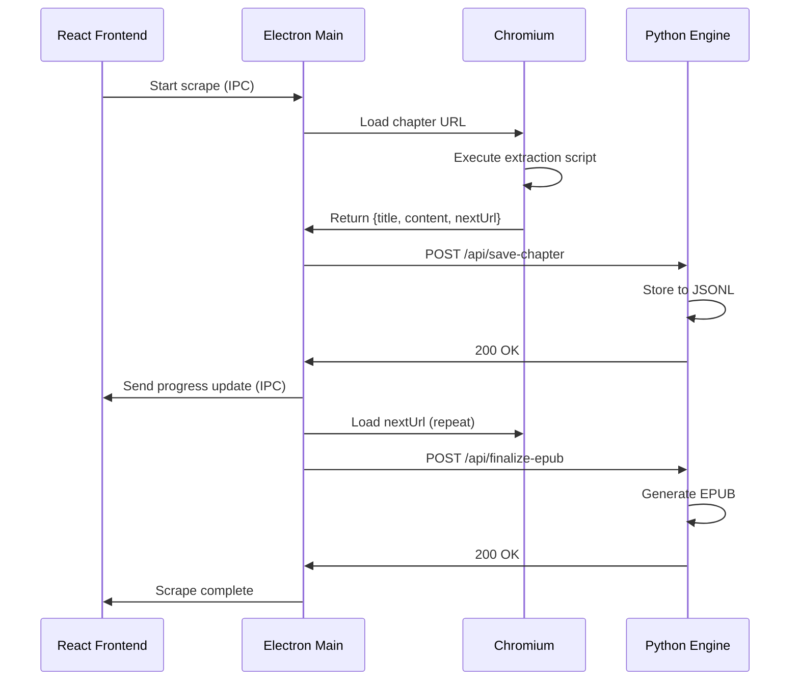

## Overview

UNS uses a **sidecar architecture** where Electron acts as the orchestrator between three layers:
1. **React Frontend** - User interface
2. **Electron Main Process** - Browser automation and IPC
3. **Python Backend** - Data processing and EPUB generation

This design allows the app to bypass bot detection by using Chromium as a real browser while leveraging Python's EPUB generation libraries.

## Directory Structure

```plaintext
UNS/
├── main.js                    # Electron main process
├── preload.js                 # IPC bridge (renderer → main)
├── package.json               # Root dependencies
│
├── assets/                    # App icons
│   ├── icon.png              # Linux icon
│   ├── icon.icns             # macOS icon
│   └── icon.ico              # Windows icon
│
├── frontend/                  # React app (Vite)
│   ├── package.json          # Frontend dependencies
│   ├── vite.config.js        # Vite configuration
│   ├── index.html            # Entry HTML
│   ├── tailwind.config.js    # Tailwind CSS config
│   │
│   └── src/
│       ├── main.jsx          # React entry point
│       ├── App.jsx           # Root component with routing
│       ├── index.css         # Global styles
│       │
│       ├── components/       # Reusable UI components
│       │   └── Navigation.jsx
│       │
│       └── pages/            # Route components
│           ├── Download.jsx   # Scraper interface
│           ├── History.jsx    # Download history
│           ├── Library.jsx    # EPUB library
│           ├── Providers.jsx  # Provider marketplace
│           └── Reader.jsx     # Built-in EPUB reader
│
└── backend/                   # Python FastAPI engine
    ├── api.py                # Main FastAPI app
    ├── requirements.txt      # Python dependencies
    ├── engine.spec           # PyInstaller config
    │
    └── dist/                 # Compiled binaries
        └── engine            # Standalone Python executable
```

## Core Files

### main.js (Electron Main Process)

**Location:** `/main.js` (500 lines)

**Responsibilities:**
- Launch and manage the Python engine subprocess
- Create and manage browser windows (main UI + scraper)
- Handle IPC communication with React frontend
- Control Chromium for web scraping
- Execute JavaScript in web pages to extract content
- Manage provider scripts (load, install, delete)
- Detect and handle Cloudflare challenges

**Key functions:**

| Function | Purpose | Line |
|----------|---------|------|
| `startPythonBackend()` | Spawns the Python engine process | 31 |
| `waitForEngine()` | Polls engine health endpoint | 51 |
| `loadExternalProviders()` | Loads provider scripts from user data | 63 |
| `createWindow()` | Creates the main UI window | 90 |
| `createScraperWindow()` | Creates hidden browser for scraping | 108 |
| `detectCloudflare()` | Checks if page is Cloudflare challenge | 126 |
| `scrapeChapter()` | Recursive scraping loop | 148 |

**Engine path resolution:**

```javascript main.js:33-35
const enginePath = isPackaged
    ? path.join(process.resourcesPath, 'bin', 'engine')
    : path.join(__dirname, 'backend', 'dist', 'engine');
```

### preload.js (IPC Bridge)

**Location:** `/preload.js`

**Purpose:** Exposes safe IPC methods to the React frontend via `contextBridge`.

**API exposed to renderer:**

```javascript
window.electronAPI = {
  // Scraping
  startScrape: (jobData) => ipcRenderer.send('start-browser-scrape', jobData),
  stopScrape: (jobData) => ipcRenderer.send('stop-scrape', jobData),
  onScrapeStatus: (callback) => ipcRenderer.on('scrape-status', callback),
  
  // Providers
  getProviders: () => ipcRenderer.invoke('get-providers'),
  installProvider: (data) => ipcRenderer.invoke('install-from-url', data),
  deleteProvider: (id) => ipcRenderer.invoke('delete-provider', id),
  
  // Search & Details
  searchNovel: (data) => ipcRenderer.invoke('search-novel', data),
  getNovelDetails: (url) => ipcRenderer.invoke('get-novel-details', url),
  
  // Library
  openEpub: (filename) => ipcRenderer.send('open-epub', filename),
  
  // Utilities
  toggleScraperView: (show) => ipcRenderer.send('toggle-scraper-view', show),
}
```

### frontend/src/App.jsx (React Router)

**Location:** `/frontend/src/App.jsx`

**Purpose:** Root component with routing and navigation.

**Routes:**

```jsx
<Routes>
  <Route path="/" element={<Library />} />
  <Route path="/download" element={<Download />} />
  <Route path="/history" element={<History />} />
  <Route path="/providers" element={<Providers />} />
  <Route path="/reader/:filename" element={<Reader />} />
</Routes>
```

### backend/api.py (Python Engine)

**Location:** `/backend/api.py` (400+ lines)

**Responsibilities:**
- Provide REST API for Electron to communicate with
- Store scraped chapters to disk (JSONL format)
- Track download progress
- Generate EPUB files with ebooklib
- Serve library metadata and cover images
- Manage download history

**Key endpoints:**

| Endpoint | Method | Purpose |
|----------|--------|----------|
| `/api/health` | GET | Health check for startup |
| `/api/save-chapter` | POST | Store scraped chapter data |
| `/api/finalize-epub` | POST | Generate EPUB from stored chapters |
| `/api/status/{job_id}` | GET | Get download progress |
| `/api/history` | GET | List all downloads |
| `/api/library` | GET | List all EPUBs |
| `/api/cover/{filename}` | GET | Extract cover image from EPUB |
| `/api/library/{filename}` | DELETE | Delete an EPUB |
| `/api/stop-scrape` | POST | Mark download as paused |

**Data storage:**

```plaintext
<userData>/
├── output/
│   ├── jobs/
│   │   └── {job_id}_progress.jsonl    # Chapter data
│   ├── epubs/
│   │   └── {job_id}.epub              # Generated EPUBs
│   └── history/
│       ├── jobs_history.json          # Download metadata
│       └── active_scrapes.json        # Active scrape state
└── providers/
    └── {provider_id}.js               # Provider scripts
```

**Chapter storage format (JSONL):**

```json
{"title": "Chapter 1", "content": ["Paragraph 1", "Paragraph 2"], "next_url": "..."}
{"title": "Chapter 2", "content": ["..."], "next_url": "..."}
```

## Data Flow

### Scraping Flow



### Provider System

**Provider script structure:**

```javascript provider-example.js
module.exports = {
  id: 'example-site',
  name: 'Example Site',
  version: '1.0.0',
  icon: 'https://example.com/icon.png',
  categories: ['popular', 'latest'],
  
  // Return search URL
  getSearchUrl: (query, page) => {
    return `https://example.com/search?q=${query}&page=${page}`;
  },
  
  // Return category URL
  getCategoryUrl: (categoryId, page) => {
    return `https://example.com/${categoryId}?page=${page}`;
  },
  
  // Extract search/category results
  getListScript: () => `
    (() => {
      return Array.from(document.querySelectorAll('.novel-item')).map(el => ({
        title: el.querySelector('.title').innerText,
        url: el.querySelector('a').href,
        cover: el.querySelector('img')?.src,
      }));
    })()
  `,
  
  // Extract novel details
  getNovelDetailsScript: () => `
    (() => {
      return {
        description: document.querySelector('.description').innerText,
        allChapters: Array.from(document.querySelectorAll('.chapter-link')).map(a => ({
          title: a.innerText,
          url: a.href,
        })),
      };
    })()
  `,
  
  // Extract chapter content (optional, uses fallback if not provided)
  getChapterScript: () => `
    (() => {
      return {
        title: document.querySelector('.chapter-title').innerText,
        paragraphs: Array.from(document.querySelectorAll('.chapter-content p')).map(p => p.innerText),
        nextUrl: document.querySelector('.next-chapter')?.href,
      };
    })()
  `,
};
```

**Provider loading:**

1. Electron scans `<userData>/providers/` on startup (main.js:489)
2. Each `.js` file is `require()`'d and added to the `providers` object (main.js:76)
3. Frontend fetches the list via `get-providers` IPC (main.js:295)
4. User can install new providers from URLs (main.js:327)

## Key Technologies

### Frontend Stack

| Technology | Purpose | Version |
|------------|---------|----------|
| **React** | UI framework | 19.2 |
| **React Router** | Client-side routing | 7.13 |
| **Vite** | Build tool & dev server | 7.3 |
| **Tailwind CSS** | Styling | 4.2 |
| **Lucide React** | Icon library | 0.577 |
| **ePub.js** | EPUB rendering | 0.3.93 |
| **React Reader** | EPUB reader component | 2.0.15 |

### Backend Stack

| Technology | Purpose | Version |
|------------|---------|----------|
| **FastAPI** | Web framework | Latest |
| **Uvicorn** | ASGI server | Latest |
| **ebooklib** | EPUB generation | Latest |
| **Pydantic** | Data validation | Latest |
| **PyInstaller** | Compile to binary | Latest |
| **Botasaurus** | Web automation helpers | Latest |

### Electron Stack

| Technology | Purpose | Version |
|------------|---------|----------|
| **Electron** | Desktop framework | 40.7 |
| **electron-builder** | App packager | 26.8 |
| **Axios** | HTTP client | 1.13 |
| **Concurrently** | Run parallel commands | 9.2 |

## Architecture Patterns

### Sidecar Pattern

The Python engine runs as a **sidecar process**:

```
┌─────────────────────────────────────┐
│ Electron Main Process               │
│  ├─ Manages app lifecycle           │
│  ├─ Controls browser windows        │
│  └─ Spawns Python subprocess        │
└──────┬────────────────┬─────────────┘
       │                │
       ▼                ▼
  ┌─────────┐    ┌────────────┐
  │ Chromium│    │ Python API │
  │ Browser │    │ :8000      │
  └─────────┘    └────────────┘
```

**Benefits:**
- Python can be updated independently
- Browser automation stays in Electron (better detection bypassing)
- Python handles EPUB generation (better library support)

### IPC Communication

Electron's IPC is used for React ↔ Main Process communication:

```
React (renderer)  ←──IPC──→  Main Process
       │                          │
       │                          ├─ Controls browser
       │                          ├─ Manages Python
       └─ Displays UI             └─ Handles file system
```

**Pattern:**
1. React calls `window.electronAPI.method()` (exposed by preload.js)
2. Preload.js sends IPC message to main process
3. Main process performs privileged operation
4. Main process sends result back via IPC

## Common Workflows

### Adding a New Page

<Steps>
  <Step title="Create the page component">
    ```bash
    touch frontend/src/pages/NewPage.jsx
    ```
  </Step>

  <Step title="Add route in App.jsx">
    ```jsx frontend/src/App.jsx
    import NewPage from './pages/NewPage';
    
    <Route path="/new" element={<NewPage />} />
    ```
  </Step>

  <Step title="Add navigation link">
    ```jsx frontend/src/components/Navigation.jsx
    <NavLink to="/new">New Page</NavLink>
    ```
  </Step>
</Steps>

### Adding a New IPC Handler

<Steps>
  <Step title="Add handler in main.js">
    ```javascript main.js
    ipcMain.handle('my-new-action', async (event, data) => {
      // Do something
      return result;
    });
    ```
  </Step>

  <Step title="Expose in preload.js">
    ```javascript preload.js
    myNewAction: (data) => ipcRenderer.invoke('my-new-action', data),
    ```
  </Step>

  <Step title="Call from React">
    ```jsx
    const result = await window.electronAPI.myNewAction(data);
    ```
  </Step>
</Steps>

### Adding a Python Endpoint

<Steps>
  <Step title="Define Pydantic model (if needed)">
    ```python backend/api.py
    class MyRequestData(BaseModel):
        field1: str
        field2: int
    ```
  </Step>

  <Step title="Add endpoint">
    ```python backend/api.py
    @app.post("/api/my-endpoint")
    async def my_endpoint(data: MyRequestData):
        # Process data
        return {"result": "success"}
    ```
  </Step>

  <Step title="Rebuild the engine">
    ```bash
    cd backend
    source venv/bin/activate
    python -m PyInstaller engine.spec
    ```
  </Step>

  <Step title="Call from Electron">
    ```javascript main.js
    const response = await axios.post('http://127.0.0.1:8000/api/my-endpoint', data);
    ```
  </Step>
</Steps>

## Testing Strategy

### Manual Testing Checklist

- [ ] App launches without errors
- [ ] All pages load (Library, Download, History, Providers)
- [ ] Can search novels from different providers
- [ ] Can start a scrape and see progress
- [ ] Can pause/resume downloads
- [ ] EPUBs appear in library after completion
- [ ] Can open EPUBs in the built-in reader
- [ ] Can install/delete providers
- [ ] Cloudflare bypass works (if enabled)

### Debugging Tips

**Frontend issues:**
- Open DevTools: Cmd/Ctrl + Shift + I
- Check Console for React errors
- Use React DevTools extension

**Main process issues:**
- Check terminal output where `npm run dev` is running
- Add `console.log()` in main.js
- Use `console.error()` for Python engine errors

**Python engine issues:**
- Test the binary directly: `./backend/dist/engine /tmp/test`
- Check `pythonProcess.stderr` logs in main.js:48
- Add print statements in api.py (they'll appear in main.js logs)

**Build issues:**
- Delete `node_modules/`, `frontend/node_modules/`, `backend/venv/`
- Reinstall all dependencies
- Rebuild Python engine from scratch
- Clear electron-builder cache: `rm -rf ~/Library/Caches/electron-builder/`

## Next Steps

<CardGroup cols={2}>
  <Card title="Development Setup" icon="wrench" href="/development/setup">
    Set up your development environment
  </Card>
  <Card title="Building for Production" icon="hammer" href="/development/building">
    Package the app for distribution
  </Card>
</CardGroup>